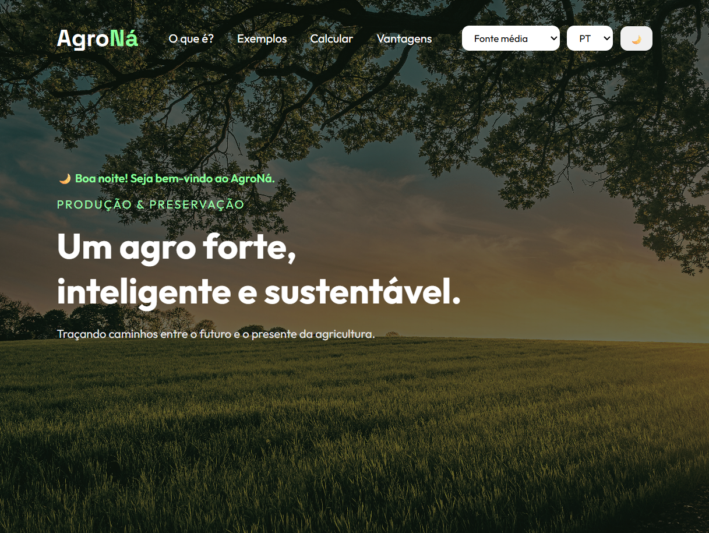

# AgroNá — Projeto Agrinho 2026

 
 
 

O AgroNá é um projeto web desenvolvido como parte do programa Agrinho 2026, com foco em sustentabilidade aplicada ao contexto agrícola e na conscientização sobre o uso responsável dos recursos naturais. O objetivo principal do projeto é demonstrar, por meio de uma interface interativa e acessível, como a tecnologia pode ser utilizada como ferramenta educativa para aproximar conceitos ambientais do cotidiano, tornando temas como preservação ambiental, uso consciente da terra, eficiência no uso de recursos e equilíbrio entre produção e natureza mais claros, acessíveis e aplicáveis à realidade do usuário. O site foi estruturado para organizar essas informações de forma intuitiva e visualmente coerente, promovendo uma navegação fluida e incentivando uma compreensão mais profunda sobre o impacto das atividades humanas no meio ambiente e a relevância de práticas agrícolas sustentáveis no contexto atual.

O projeto também foi desenvolvido com atenção especial à experiência do usuário e à acessibilidade, buscando atender diferentes perfis de navegação e níveis de familiaridade com o tema. A estrutura do site foi planejada com base em hierarquia de informações, organização visual e interatividade, de modo a facilitar a compreensão do conteúdo e tornar a experiência mais dinâmica. Elementos como a calculadora de sustentabilidade e ajustes de interface contribuem para transformar o projeto em uma ferramenta que vai além da informação, permitindo uma aplicação prática dos conceitos apresentados e reforçando o aprendizado de forma mais significativa.

Em relação ao desenvolvimento, o projeto foi inteiramente criado por mim, sendo o responsável por toda a estrutura, organização e implementação das funcionalidades da aplicação. A base técnica foi construída utilizando HTML, CSS e JavaScript, tecnologias fundamentais do desenvolvimento web, que permitiram a criação de uma interface responsiva, funcional e interativa. Entre os principais recursos desenvolvidos está a calculadora de sustentabilidade, que processa dados inseridos pelo usuário e gera uma pontuação baseada em critérios ambientais, traduzindo conceitos teóricos em uma experiência prática e compreensível. Todo o desenvolvimento foi guiado por critérios de clareza, consistência visual e usabilidade.

As imagens utilizadas no projeto foram obtidas da plataforma Unsplash e passaram por pequenas edições no Canva para melhor adequação ao design do site, enquanto as fontes tipográficas foram fornecidas pelo Google Fonts, contribuindo para uma identidade visual mais moderna, legível e coerente com a proposta do projeto.

Os créditos gerais incluem essas fontes visuais, além do uso do ChatGPT como ferramenta de apoio no desenvolvimento, auxiliando na organização de ideias, estruturação do conteúdo e revisão de partes do código ao longo da construção do projeto.
